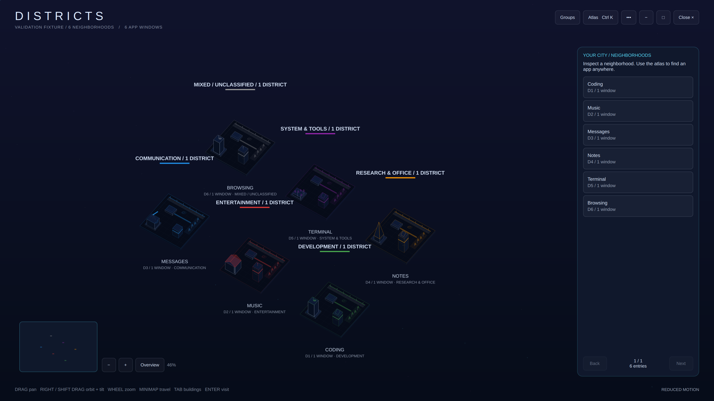

<p align="center"></p>

<p align="center">
  <a href="https://github.com/nixfred/omarchy-districts/actions/workflows/ci.yml"></a>
  
  
</p>

**Your desktop, with a skyline.** Districts turns real Omarchy workspaces into neighborhoods and actual app windows into buildings. Explore the city, find a window, inspect its measured resources, or follow a supported local agent session.

Click the skyline in your bar to open or restore one native, resizable application. It has maximize/restore, minimize and close controls. The city uses your desktop theme, with readable panels and explicit pages instead of scrolling lists. No Districts account, cloud service, Infomarchy installation or extra Python package is required. Agent features use only locally available providers; Districts does not start one for you.




Screenshots show public, synthetic app fixtures rendered by the native plugin. They contain no live desktop or agent conversation data.

## Explore from any angle

Orbit through a full **360°** and change the vertical tilt between **20° and 75°**. Buildings retain their real identity while the visible faces, drawing order and selection geometry follow the camera. District labels remain readable, and the minimap keeps navigation grounded. Pan, zoom, select a building, or return to **Overview**; reset the camera to its original orientation whenever you need it.

**Viewpoints** saves up to twelve named camera views, including orientation and framing. Restore a view against the current city; a vanished district is never recreated. **Guided tour** visits neighborhoods actually present when you start it. Stop at any point, or take over by navigating yourself. Reduced motion uses immediate camera steps.

Two ways to make a busy city easier to read:

- **Focus Lens:** temporarily show one app, district, activity group or observed agent family. Counts explain what is shown. Clear the lens to return to the whole city. This changes the visualization only.
- **Activity Replay:** inspect retained metadata observations since tracking began. Scrub or play changes in window membership and provider-reported agent status, then return to the latest live city. Historical views are marked and cannot dispatch window or agent actions.

Replay is an observation buffer, not a recovered desktop history. It stays in RAM, retains at most thirty minutes, 120 frames and an estimated 512 KiB of serialized payload, and samples no faster than every two seconds. Short events between samples can be missed. Tracking gaps start a fresh baseline; historical CPU is unavailable. **Clear history** discards the buffer.

## Neighborhoods that make sense

| Activity | Default color | Public app evidence |
| --- | --- | --- |
| Development | Green | Editors, IDEs and development app categories |
| Entertainment | Red | Media players and games |
| Communication | Blue | Messaging, email and chat apps |
| Research & Office | Orange | Notes, reference tools and office apps |
| System & Tools | Purple | Terminals, file managers and utilities |
| Mixed / Unclassified | Gray | Ties, empty districts or insufficient evidence |

Distinct app identities vote once; ties stay mixed. Generic browsers do not outweigh a clearly identified activity app. Classification uses public compositor classes and allowlisted desktop-entry metadata, with a six-second settling period. Changing focus does not rearrange the city. Browser pages, URLs and other applications’ window titles are never used to guess what you are doing.

Open **Groups**, or click a group heading, to edit its color. Reusable app rules apply wherever an identity appears and remain editable after the app closes. **Automatic** restores detection. Personal district names, pins and circuit accents stay separate. Visual grouping preserves real workspace numbers and membership.

## Find, inspect and organize

1. Open **Atlas** (`Ctrl K`), search a public app or district label, and inspect the result. **Enter app window** focuses that exact current window.
2. Select a building to inspect its owner CPU, or open its resource details for resident/virtual memory, threads and bounded file-descriptor counts. Missing or inaccessible counters are labeled unavailable.
3. Use **Move to district…** for one window, or **Organize** for a proposed consolidation plan. Review the public app identities and exact source/destination districts before pressing **Apply**.

Organization protects named/pinned districts and focused windows, excludes unsupported entries, and proposes at most 32 moves. A preview expires after two minutes. Apply rechecks the actual desktop before each move; changed membership or identity blocks further action. Results distinguish confirmed, blocked, unconfirmed and unattempted moves. Cancel moves nothing. There is no automatic arrangement or blind undo.

Warm facade lights reflect the measured **window-owner process CPU**. Sampling deduplicates shared owners, runs no more often than every 2.5 seconds and smooths brightness over six seconds. Percent is per CPU core. A terminal owner is its GUI process; a browser owner excludes renderer children. These counters do not report command progress, child CPU or agent completion. Slow measured brightness updates remain available with reduced motion.

## One Agent Desk for all sessions

Agent courts show real local provider session records. Parent/subagent links come from explicit stored spawn metadata; missing parentage and unavailable live status remain visible as limitations. Agent courts do not assert that a session owns an app window or belongs to a compositor workspace without evidence. Provider-reported states are labeled with their source, independently of CPU lights.

Open **Agent Desk** from the global control, or select any agent building to open that exact session in the same desk. Its selector includes retained stored metadata even when stored courts are hidden in the city. Choose **Read latest reply** to fetch bounded assistant text and recent assistant history, then page through responses and text. Reads stay tied to the selected provider and session. Review that identity before queuing an instruction.

| Provider / surface | Current capability |
| --- | --- |
| Verified existing Codex CLI app-server session | Metadata, selected reply, and exact loaded-session instruction queue when the required API is available |
| Codex desktop app namespace | Unsupported by this CLI adapter; it is not treated as the same transport |
| Claude Code | Live list plus recorded stored subagents and selected bounded assistant history; owning main family is known, immediate spawning parent is unknown; no verified existing-process instruction transport |
| Grok CLI | Stored sessions and explicitly recorded subagent links, selected bounded assistant history; live status and existing-process instruction transport are unavailable |
| Pi / Kimi3 through Pi | Recorded session/model metadata and selected bounded assistant history; explicit `kimi-coding/k3` models appear as Kimi while retaining Pi transport identity; no verified existing-process bridge |
| Other or disconnected providers | Explicit unavailable/unsupported state; no speculative attachment |

Districts never resumes a session to create a competing process, injects terminal keystrokes, starts a daemon, answers approval requests or changes permissions. Codex queue acknowledgement means **queued**, not executed or completed. Existing approvals and questions stay in the native client. An uncertain submission is not resent automatically. The [session guide](docs/SESSIONS.md) explains these boundaries.

## Provider allowance and pace

**Providers** shows Grok, Claude, Codex and Kimi identity markers, observed session states and a filter shared by the city and Agent Desk. Quota rows require an available, stamped source. Districts reads plain local quota metadata and Codex’s existing daemon read-only quota API; it has no Infomarchy or Burn Bar runtime dependency.

The priority headline is signed **BANKED TIME / HOW FAR BEHIND**: pace-equivalent allowance credit from a verified fixed-duration window. It is not guaranteed compute time. Usage, remaining allowance and reset are secondary. Behind pace shows an estimated wait **assuming no additional usage**, plus the desktop’s local date, time and timezone offset at recovery. This recovery estimate is separate from a rate-limit reset or permission to make requests. Unknown rolling windows, missing timestamps, stale snapshots and unavailable provider data stay explicit. With several windows, the most behind usable window leads; each window remains inspectable.

The [quota evidence guide](docs/provider-metric-matrix.md) documents units, freshness, the formula, sources and limitations.

## Install on an existing Omarchy desktop

Requires a working Omarchy Quickshell desktop, Hyprland 0.56+ with its scoped Lua dispatch API, and Python 3.10+. Run from your normal desktop session:

```bash
git clone https://github.com/nixfred/omarchy-districts.git ~/Projects/omarchy-districts
cd ~/Projects/omarchy-districts
python3 install.py --enable
```

The installer validates the release and stages a separate runtime under `~/.config/omarchy/plugins/nixfred.districts`. Its receipt records file hashes and the backup location. Scoped discovery/activation uses Omarchy’s plugin APIs; it does not restart the whole shell. A rescan may recreate plugin components and services. Existing placement and unrelated settings must be preserved during an update.

Automatic activation verifies both live and saved settings. If the shell explicitly reports that its optional persistence-status API is absent, the installer checks matching live and saved configuration instead; other persistence errors stop activation. To stage separately and use supported scoped discovery:

```bash
python3 install.py
omarchy-shell shell rescanPlugins
# New installation only; retain existing placement on updates:
omarchy plugin enable nixfred.districts --section right
```

**Update:** close Districts, preserve local source edits, fast-forward the checkout and reinstall. Do not reset a dirty checkout or overwrite unrelated local changes.

```bash
omarchy-shell nixfred.districts close
git -C ~/Projects/omarchy-districts pull --ff-only
python3 ~/Projects/omarchy-districts/install.py --enable
```

For a staging check without live activation:

```bash
python3 install.py --destination /tmp/districts-preview/nixfred.districts \
  --receipt /tmp/districts-preview/installation.json
```

Disable with `omarchy plugin disable nixfred.districts`. To roll back, close Districts, restore only its previous plugin directory from the receipt’s backup, then rescan. Compare the latest configuration before restoring any saved settings: a backup must not erase later unrelated changes.

## Controls and preferences

| Control | Action |
| --- | --- |
| Drag / edge glide | Pan the city |
| Orbit and tilt controls | Rotate the view / change elevation |
| Wheel, `+`, `−` | Zoom around the pointer / map center |
| Minimap | Travel across the city |
| Click / double-click | Select / frame a building or district |
| `F`, Home / Overview | Fit the current city |
| `Tab`, `Shift Tab` | Select app buildings |
| `Ctrl K` / Atlas | Find a district or app |
| Atlas `↑ ↓`, `PgUp PgDn` | Select a result / change page |
| `Enter` | Inspect an Atlas result or visit the live selection |
| `N` | Name the selected district |
| `R` | Refresh |
| `Esc` | Dismiss the current panel or close the city |

Day/night, reduced motion and edge glide are explicit preferences. Closing or minimizing stops city collection and animation; the bar restores the singleton application. Saved architecture preferences and camera viewpoints persist locally with mode `0600`. Replay is never persisted.

## Privacy and verification

The ordinary city collector uses title-free window metadata and measured owner counters. Agent inventory contains identifiers, explicit family relationships and reported state; chat text is fetched only for the selected session on request. Selected replies and drafts stay out of replay. No screenshots, browser URLs, command lines or transcript contents are used for classification or resource lighting, and no external telemetry is added by Districts.

Window actions revalidate live identity and membership. Resource inspection verifies the owner before and after reading counters, including process start time to detect PID reuse. Historical views cannot enter, move, organize or instruct anything. Ordinary city snapshots are bounded at 512 windows/workspaces; the map raster is capped at six million physical pixels. Decorative buildings are architecture, not invented app telemetry.

Portable checks, native synthetic fixtures, live installed checks and independent source review provide different evidence. A passing CI badge is evidence for its linked commit; fixture captures do not establish behavior on every physical monitor. Checks and their limits are recorded in [verification/RELEASE.json](verification/RELEASE.json) and the [review record](review/README.md).

## Development

No build or bundling step is needed. The versioned runtime directory is named by `manifest.json`; root source copies support the fixtures and must remain byte-identical. The installer copies only the validated runtime and release documents.

```bash
python3 tools/check-project.py
python3 -m unittest discover -s tests -p 'test_*.py'
for check in tests/*.js; do node "$check"; done
```

Native checks require Omarchy, Wayland, Quickshell and QtTest. See the [development guide](docs/DEVELOPMENT.md) for environment requirements, fixture scope and controlled screenshot capture.

MIT licensed, © 2026 Fred Nix. Built for Omarchy and Quickshell; standalone from Infomarchy. Original source and historical review credits are retained in the repository history and [review record](review/README.md).

The multi-provider extension is tracked separately in [extension verification](verification/EXTENSION.json). The earlier [release record](verification/RELEASE.json) covers its named frozen snapshot only. The extension record identifies the subsequent external source review, finding dispositions and validated runtime.
