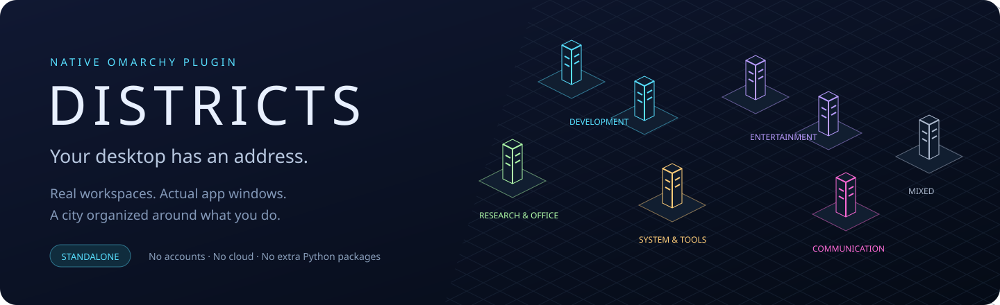
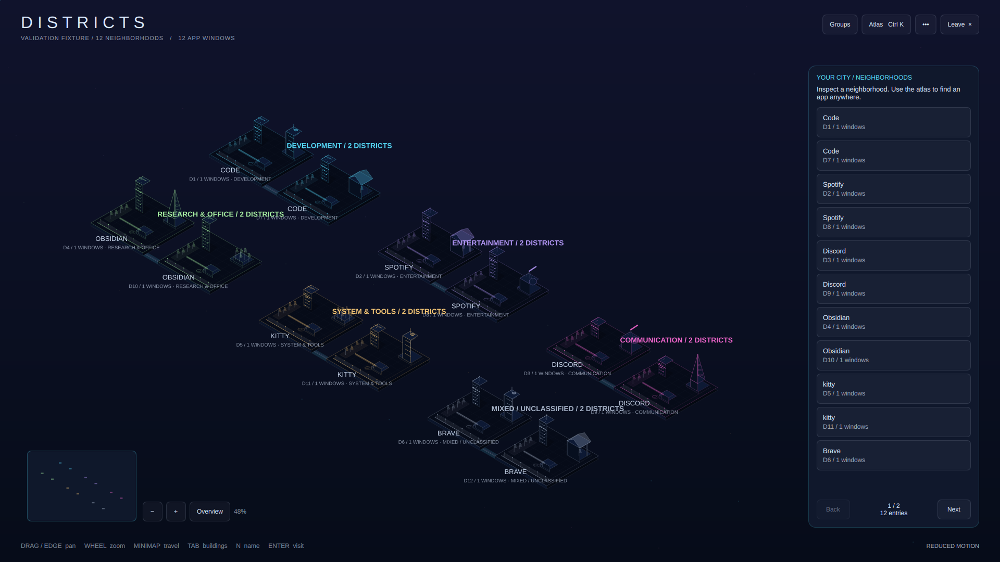
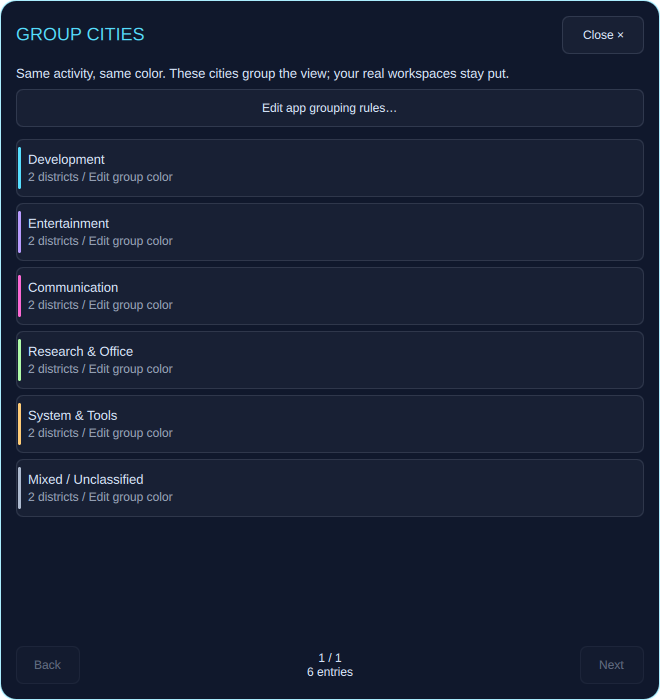
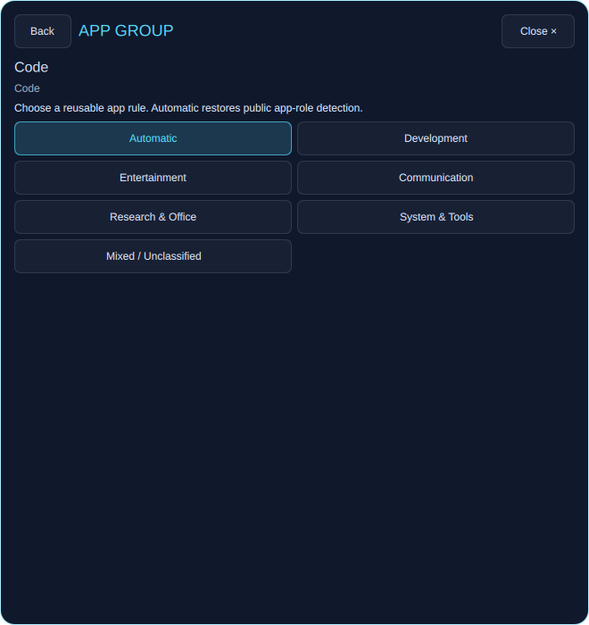
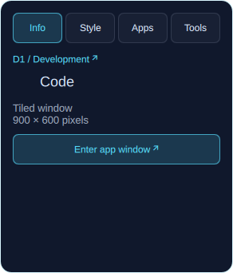

<p align="center"></p>

<p align="center">
  <a href="https://github.com/nixfred/omarchy-districts/actions/workflows/ci.yml"></a>
  
  
</p>

**Districts turns your actual Omarchy desktop into a living isometric city.** Workspaces become neighborhoods. Real app windows become buildings. The city groups itself around what you do, with readable labels and a distinct color for each activity.

Click the skyline in your bar. Explore. Find an app. Enter its real window—or tidy its workspace with an explicit move. No account, cloud service, Infomarchy installation, or extra Python package is needed.



*Actual Quickshell rendering with a synthetic public-app fixture. Every screenshot in this README is captured from the native plugin’s own surface; no private desktop contents were photographed.*

## A city that makes sense

| Group | Default color | Evidence examples |
| --- | --- | --- |
| **Development** | Cyan | Code, Zed, known IDEs, public Development app categories |
| **Entertainment** | Violet | Spotify, VLC, Steam, public game/media categories |
| **Communication** | Pink | Slack, Discord, Signal, email and chat apps |
| **Research & Office** | Green | Obsidian, Zotero, LibreOffice, public office/study categories |
| **System & Tools** | Amber | Terminals, file managers and utilities when no clearer activity is present |
| **Mixed / Unclassified** | Gray | Ties, empty workspaces and apps without enough activity evidence |

Distinct app identities vote once. A majority determines the activity; ties stay mixed. Generic browsers and system helpers do not outweigh a clearly identified activity app. An explicit compositor workspace name can supply a group when app roles provide no activity signal. Personal Districts names remain your labels.

**Browser pages, URLs and window titles are never inspected.** A browser may be work, a film or a game; Districts does not pretend to know. Automatic role changes settle for six seconds. Merely changing focus never rearranges the city.

Grouping is visual: **real workspace numbers and window membership stay unchanged**.

## Change the grouping, once

<p align="center"></p>

Open **Groups**, or click a city heading. Edit a color for the entire group. The legend keeps labels alongside color, shows actual district counts, and explains the selected district’s classification. Each group uses a different color. Your existing names, pins and personal circuit accents stay preserved.

**Edit app grouping rules** changes a reusable rule wherever that public app identity appears. Choose **Automatic** to restore detection. Saved rules remain editable after an app closes; you never have to categorize districts one by one.

<p align="center"></p>

## Three useful everyday flows

1. **Find the app you meant to use.** Open **Atlas** (`Ctrl K`), search a public app or district label, and inspect the result. **Enter app window** then focuses that exact current window.
2. **Follow an app across your desktop.** Inspect a building → **Tools** → **Trace this app**. The map highlights its actual windows across districts; inspect a result before entering it.
3. **Put a misplaced window where it belongs.** Inspect → **Tools** → **Move to district…**. Choose an existing destination and confirm. The window moves while your current workspace stays put. **Cancel** makes no move.

The inspector has **Info**, **Style**, **Apps** and **Tools** views. Lists use **Back / Next** pages with complete wrapped labels, so data stays readable without scrolling. Map dragging and zooming remain deliberate city navigation.

<p align="center"></p>

## Install on an existing Omarchy desktop

Requires a working Omarchy Quickshell desktop, Hyprland and Python 3.10+. The plugin uses Python’s standard library. Run these commands in your normal desktop session:

```bash
git clone https://github.com/nixfred/omarchy-districts.git ~/Projects/omarchy.districts.plugin
cd ~/Projects/omarchy.districts.plugin
python3 install.py --enable
```

The installer validates and copies the release into `~/.config/omarchy/plugins/nixfred.districts`, backs up its previous runtime, and uses Omarchy’s supported plugin rescan/enable APIs. An existing bar placement and unrelated settings are preserved. A new installation appends the skyline to the right section. It does not restart your shared shell.

**Updating an existing checkout:** close Districts first, preserve any local source edits, then:

```bash
omarchy-shell nixfred.districts close
git -C ~/Projects/omarchy.districts.plugin pull --ff-only
python3 ~/Projects/omarchy.districts.plugin/install.py --enable
```

To stage without changing the live desktop:

```bash
python3 install.py --destination /tmp/districts-preview/nixfred.districts \
  --receipt /tmp/districts-preview/installation.json
```

Disable with `omarchy plugin disable nixfred.districts`. The full source remains in your project directory; installed runtime files are a separate copy.

## Controls

| Control | Action |
| --- | --- |
| Drag / pointer near a map edge | Pan / gentle edge glide |
| Wheel, `+`, `−` | Zoom around the pointer / map center |
| Minimap | Travel across the city |
| Click / double-click | Select / fly closer to inspect |
| `F` / Overview | Fit the city |
| `Tab`, `Shift Tab` | Select app buildings |
| `Ctrl K` / Atlas | Find a district or app |
| Atlas `↑ ↓`, `PgUp PgDn` | Select a result / change page |
| `Enter` | Inspect an atlas result; enter the selected app/workspace from the city |
| `N` | Name the selected district |
| `R` | Refresh |
| `Esc` / Leave | Cancel the current modal or leave the city |

**Style** preserves a personal name, pin and circuit. Leaving a name blank restores the observed name. The ellipsis menu includes day/night, reduced motion and edge-glide settings.

## Privacy, performance and limits

- No titles, thumbnails, terminal text, file contents, URLs, transcripts or private screenshots are collected. Public app identity comes from compositor class and allowlisted desktop-entry metadata.
- Procedural seeds, your explicit names/pins/circuits, group colors and chosen app-identity rules persist in `$XDG_STATE_HOME/districts/architecture.json` (mode `0600`). Automatic classifications and transient window addresses stay in memory. Up to 128 manual app rules are supported.
- Navigation revalidates a window’s address, app class and workspace. Relocation requires a fresh existing destination and an explicit confirmation. Failure never reopens the city to steal focus.
- Ambient animation is capped at 15 fps, camera navigation at 30 fps. Reduced motion and closed views stop animation; closed views stop collection. A visible active city has a debounced collector and a 2.5-second recovery poll.
- Snapshots are bounded at 512 windows and 512 ordinary workspaces. Special/scratchpad windows are excluded. The map raster is capped at six million physical pixels. Decorative civic buildings are architecture, not invented app telemetry.
- Native layouts are checked down to **912 × 512 logical pixels**, including full 48-character district labels, 64-character app labels and 96-character public identities. Larger and fractional output captures are synthetic viewport checks on Vic, not a claim of testing every physical monitor or Gus.

A 30-window native fixture measured about **1.25% of one CPU core** with ambient motion and **0% while reduced or closed** during short samples. This is a measured fixture, not a hardware-wide performance guarantee.

## Development and checks

Runtime source is in `v2.2/`; root copies support the local test harness. Keep them byte-identical when changing runtime code. `install.py` copies only the validated 14-file release, not test logs, private desktop backups or review infrastructure.

Portable checks need Python and Node, with no Python package installation:

```bash
python3 -m unittest discover -s tests -p 'test_bridge.py'
node tests/model.js
node tests/camera.js
node tests/groups.js
```

Native checks require an awake Omarchy Wayland session with Quickshell’s QtTest support and `OMARCHY_PATH` pointing to your Omarchy checkout:

```bash
python3 tests/grouping.py
python3 tests/pagination.py
python3 tests/interaction.py
python3 tests/resolutions.py
python3 tests/performance.py
```

These use synthetic fixtures, temporary state and their own scoped processes. They never dispatch real window moves or restore an old desktop layout. The 2.2 release passed 45 bridge/state checks, classification and 512-district geometry checks, native grouping/page/action checks, viewport captures, and a live independent Kimi K3 source audit with verified fixes.

MIT licensed. Built for Omarchy; standalone from Infomarchy.
